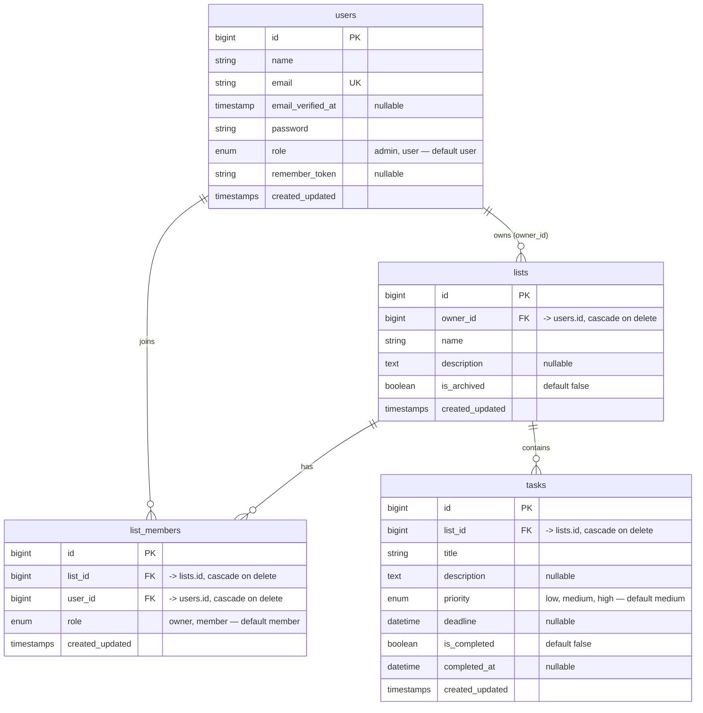

# ERD — JARA (Advanced To Do List)

> **Sumber kebenaran struktur database.** Semua programmer WAJIB mengikuti skema ini.
> Perubahan skema HANYA lewat file migration di git — dilarang CREATE/ALTER manual.
> Database: MySQL 8.x lokal (Laragon) · database `jara` · tanpa SSL.

## Diagram



## Detail Tabel

### `users` — Programmer 1 (F-01 s.d F-06)
| Kolom | Tipe | Atribut |
|---|---|---|
| `id` | bigint unsigned | PK, auto increment |
| `name` | varchar(255) | not null |
| `email` | varchar(255) | not null, **unique** (dipakai login) |
| `email_verified_at` | timestamp | nullable |
| `password` | varchar(255) | not null (bcrypt) |
| `role` | enum(`admin`,`user`) | not null, default `user`, indexed |
| `remember_token` | varchar(100) | nullable |
| `created_at` / `updated_at` | timestamp | nullable |

Migration: `0001_01_01_000000_create_users_table.php` (bawaan Laravel + kolom `role`).

### `lists` — Programmer 2 (F-07 s.d F-10)
| Kolom | Tipe | Atribut |
|---|---|---|
| `id` | bigint unsigned | PK, auto increment |
| `owner_id` | bigint unsigned | FK → `users.id`, **cascade on delete**, indexed |
| `name` | varchar(255) | not null |
| `description` | text | nullable |
| `is_archived` | boolean | default `false`, indexed |
| `created_at` / `updated_at` | timestamp | nullable |

Migration: `2026_09_09_042223_create_lists_table.php`.

### `list_members` — Programmer 2 (F-11, F-12)
| Kolom | Tipe | Atribut |
|---|---|---|
| `id` | bigint unsigned | PK, auto increment |
| `list_id` | bigint unsigned | FK → `lists.id`, **cascade on delete** |
| `user_id` | bigint unsigned | FK → `users.id`, **cascade on delete**, indexed |
| `role` | enum(`owner`,`member`) | default `member` |
| `created_at` / `updated_at` | timestamp | nullable |
| **Unique** | `(list_id, user_id)` | cegah anggota ganda |

Migration: `2026_09_09_042225_create_list_members_table.php`.

### `tasks` — Programmer 3 (F-13 s.d F-18)
| Kolom | Tipe | Atribut |
|---|---|---|
| `id` | bigint unsigned | PK, auto increment |
| `list_id` | bigint unsigned | FK → `lists.id`, **cascade on delete** |
| `title` | varchar(255) | not null |
| `description` | text | nullable |
| `priority` | enum(`low`,`medium`,`high`) | default `medium`, indexed |
| `deadline` | datetime | nullable, indexed (filter overdue / hari ini) |
| `is_completed` | boolean | default `false` |
| `completed_at` | datetime | nullable (diisi saat ditandai selesai) |
| `created_at` / `updated_at` | timestamp | nullable |
| **Index komposit** | `(list_id, is_completed)` | progress bar per daftar (F-18) |

Migration: `2026_09_09_042226_create_tasks_table.php`.

## Aturan Relasi (kontrak antar programmer)

1. `lists.owner_id` = pemilik. Hanya owner yang boleh edit/hapus daftar & undang anggota (F-09 s.d F-11).
2. Akses kolaborasi dicek via `list_members`: user boleh membuka daftar jika ia owner ATAU tercatat di `list_members`.
3. Saat daftar dibuat, pembuat otomatis tercatat di `list_members` dengan `role = owner`.
4. Hapus daftar → `tasks` + `list_members` ikut terhapus (cascade). Hapus user → daftar miliknya ikut terhapus.
5. Progress daftar = `COUNT(tasks is_completed = true) / COUNT(tasks)` per `list_id` (F-18).

## Setup Database per Programmer

1. Pastikan MySQL Laragon berjalan, lalu buat database:
   ```sql
   CREATE DATABASE IF NOT EXISTS `jara` CHARACTER SET utf8mb4 COLLATE utf8mb4_unicode_ci;
   ```
2. Copy `.env.example` menjadi `.env`, sesuaikan `DB_PASSWORD` dengan password root Laragon masing-masing:
   ```env
   DB_CONNECTION=mysql
   DB_HOST=127.0.0.1
   DB_PORT=3306
   DB_DATABASE=jara
   DB_USERNAME=root
   DB_PASSWORD=
   ```
3. Jalankan:
   ```powershell
   php artisan migrate:fresh
   php artisan db:show
   ```
